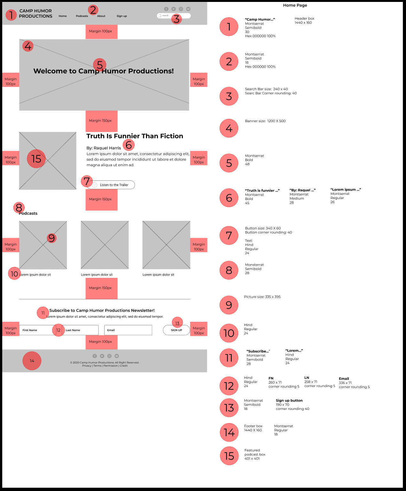
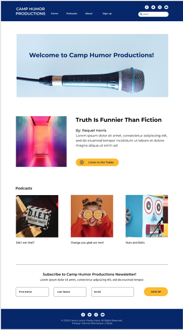
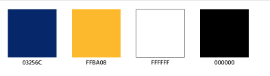

# CampHumor

**Elevator Pitch:**  
Comedy Podcast Company. Collaboration between 2 UX/UI Designers and 4 Software Engineers from General Assembly. Two Days to Complete Project. 

---

## Deliverables

**MVP should include:**

1. Desktop and Mobile - Responsive

2. Landing page for users

3. Landing page for admins

4. Sign up form

5. User Validation

---

## Wireframes

## Technologies 

Express  
Mongoose  
EJS  